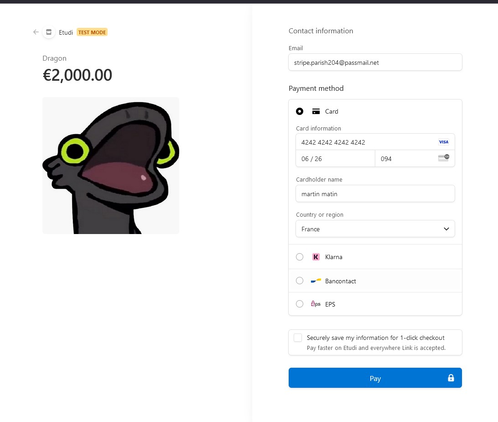

# E5-VIRTDC
Zenner-Gibeaux Geoffrey Rendu

<!-- PROJECT LOGO --> <br /><h3 align="center">Projet Kubernetes</h3>


<!-- ABOUT THE PROJECT -->
## Struture du projet

 Contenu du Manifest de production

``` yml
apiVersion: v1  # Version de l'API Kubernetes pour les objets de type Namespace
kind: Namespace  # Définition d'un espace de noms pour isoler les ressources
metadata:
  name: privrocket-preprod  # Nom du namespace
  labels:
    name: privrocket-preprod  # Étiquette pour identifier le namespace
    app: privrocket  # Étiquette pour associer les ressources à l'application PrivRocket
---
apiVersion: v1  # Version de l'API Kubernetes pour les objets de type ConfigMap
kind: ConfigMap  # Définition d'une ConfigMap pour stocker des configurations non sensibles
metadata:
  name: privrocket-app-configmap  # Nom de la ConfigMap
  namespace: privrocket-preprod  # Namespace où la ConfigMap est déployée
data:
  DEMO_MODE: "True"  # Mode démo activé
  DEBUG: "True"  # Mode debug activé
---
apiVersion: apps/v1  # Version de l'API Kubernetes pour les objets de type Deployment
kind: Deployment  # Définition d'un déploiement pour gérer les pods
metadata:
  name: privrocket-deployment  # Nom du déploiement
  namespace: privrocket-preprod  # Namespace où le déploiement est créé
  labels:
    app: privrocket-deployment  # Étiquette pour identifier le déploiement
spec:
  replicas: 1  # Nombre de réplicas (instances de pod)
  selector:
    matchLabels:
      app: privrocket-app  # Sélecteur pour associer les pods au déploiement
  template:
    metadata:
      labels:
        app: privrocket-app  # Étiquettes appliquées aux pods créés
    spec:
      containers:
      - name: privrocket-app  # Nom du conteneur
        image: th0m8s/priv-rocket-ecommerce-main:prod  # Image Docker utilisée
        ports:
          - containerPort: 80  # Port exposé par le conteneur
        resources:
          requests:
            memory: 64Mi  # Quantité minimale de mémoire demandée
            cpu: 100m  # Quantité minimale de CPU demandée
          limits:
            memory: 128Mi  # Limite maximale de mémoire autorisée
            cpu: 200m  # Limite maximale de CPU autorisée
        envFrom:
        - configMapRef:
            name: privrocket-app-configmap  # Référence à la ConfigMap pour injecter des variables d'environnement
        env:
          - name: STRIPE_PUBLISHABLE_KEY  # Clé publique Stripe injectée depuis un Secret
            valueFrom:
              secretKeyRef:
                name: stripe-secret
                key: STRIPE_PUBLISHABLE_KEY
          - name: STRIPE_SECRET_KEY  # Clé secrète Stripe injectée depuis un Secret
            valueFrom:
              secretKeyRef:
                name: stripe-secret
                key: STRIPE_SECRET_KEY
---
apiVersion: v1  # Version de l'API Kubernetes pour les objets de type Secret
kind: Secret  # Définition d'un secret pour stocker des informations sensibles
metadata:
  name: stripe-secret  # Nom du secret
type: Opaque  # Type de secret (opaque pour des données arbitraires)
stringData:
  STRIPE_PUBLISHABLE_KEY: pk_test_51QhZXSRvHxyjSySQorUMA1T2d5ZlvGWg1SX8CErNy8e3MelMghenIZG9ZPrdv4kxXtadCfbv3oBKvcDTBTU0xFA200t7v2PYl3  # Clé publique Stripe
  STRIPE_SECRET_KEY: sk_test_51QhZXSRvHxyjSySQ51yiCCUlq1pdwyKJjhUKtGZg1oBpAtiQuhoL65ZeGWy4r60TVCrYUw2rHeEgpR4RUi4aYJM600JtWIBO3M  # Clé secrète Stripe
---
apiVersion: v1  # Version de l'API Kubernetes pour les objets de type Service
kind: Service  # Définition d'un service pour exposer l'application
metadata:
  name: privrocket-deployment  # Nom du service
  labels:
    app: privrocket-svc  # Étiquette pour identifier le service
spec:
  type: LoadBalancer  # Type de service pour exposer l'application à l'extérieur du cluster
  selector:
    app: privrocket-app  # Sélecteur pour associer le service aux pods
  ports:
  - port: 80  # Port sur lequel le service écoute
    protocol: TCP  # Protocole utilisé
    targetPort: 80  # Port sur lequel le conteneur écoute
---
apiVersion: networking.k8s.io/v1  # Version de l'API Kubernetes pour les objets de type Ingress
kind: Ingress  # Définition d'un ingress pour gérer l'accès HTTP/HTTPS externe
metadata:
  name: ingress-privrocketapp  # Nom de l'ingress
spec:
  defaultBackend:
    service:
      name: privrocket-service  # Service par défaut vers lequel router le trafic (nom semble incorrect, devrait correspondre au service ci-dessus)
      port:
        number: 7777  # Port du service (incohérent avec le port 80 du service)
---
apiVersion: autoscaling/v2  # Version de l'API Kubernetes pour les objets de type HorizontalPodAutoscaler
kind: HorizontalPodAutoscaler  # Définition d'un autoscaler pour ajuster le nombre de pods
metadata:
  name: horizontal-pod  # Nom de l'autoscaler
spec:
  scaleTargetRef:
    apiVersion: apps/v1
    kind: Deployment
    name: privrocket-deployment  # Cible l'objet Deployment pour l'autoscaling
  minReplicas: 1  # Nombre minimum de pods
  maxReplicas: 50  # Nombre maximum de pods
  behavior:
    scaleUp:
      stabilizationWindowSeconds: 0  # Pas de délai de stabilisation pour l'augmentation des pods
      policies:
      - type: Percent
        value: 100  # Augmentation de 100% des pods en 5 secondes
        periodSeconds: 5
      - type: Pods
        value: 4  # Augmentation de 4 pods en 5 secondes
        periodSeconds: 5
      selectPolicy: Max  # Applique la politique la plus agressive
    scaleDown:
      stabilizationWindowSeconds: 5  # Délai de 5 secondes avant de réduire le nombre de pods
      policies:
      - type: Percent
        value: 50  # Réduction de 50% des pods en 5 secondes
        periodSeconds: 5
  metrics:
  - type: Resource
    resource:
      name: cpu
      target:
        type: Utilization
        averageUtilization: 50  # Cible d'utilisation moyenne du CPU à 50%
status:
  observedGeneration: 1  # Génération observée de l'autoscaler
  currentReplicas: 1  # Nombre actuel de pods
  desiredReplicas: 1  # Nombre de pods souhaité
  currentMetrics:
  - type: Resource
    resource:
      name: cpu
      current:
        averageUtilization: 0  # Utilisation actuelle moyenne du CPU à 0%
        averageValue: 0  # Valeur actuelle moyenne du CPU

```

 Contenu du Manifest du test de l'API

``` yml
apiVersion: apps/v1  # Version de l'API Kubernetes pour les objets de type Deployment
kind: Deployment  # Définition d'un déploiement Kubernetes
metadata:
  name: stripe-flask-app  # Nom du déploiement
  labels:
    app: stripe-flask-app  # Étiquette pour identifier les ressources associées
spec:
  selector:
    matchLabels:
      app: stripe-flask-app  # Sélecteur pour faire correspondre les pods avec cette étiquette
  template:
    metadata:
      labels:
        app: stripe-flask-app  # Étiquettes appliquées aux pods créés par ce déploiement
    spec:
      containers:
      - name: stripe-flask-app  # Nom du conteneur
        image: th0m8s/stripe-app:prod  # Image Docker à utiliser pour ce conteneur
        ports:
          - containerPort: 4242  # Port exposé par le conteneur
        resources:
          requests:
            memory: 64Mi  # Quantité minimale de mémoire demandée
            cpu: 100m  # Quantité minimale de CPU demandée
          limits:
            memory: 128Mi  # Limite maximale de mémoire autorisée
            cpu: 200m  # Limite maximale de CPU autorisée
        env:
          # Variables d'environnement injectées depuis un secret Kubernetes
          - name: STRIPE_PUBLISHABLE_KEY
            valueFrom:
              secretKeyRef:
                name: stripe-secret-app  # Nom de l'objet Secret
                key: STRIPE_PUBLISHABLE_KEY  # Clé spécifique dans le secret
          - name: STRIPE_SECRET_KEY
            valueFrom:
              secretKeyRef:
                name: stripe-secret-app
                key: STRIPE_SECRET_KEY
---
apiVersion: v1  # Version de l'API Kubernetes pour les objets de type Service
kind: Service  # Définition d'un service pour exposer l'application
metadata:
  name: stripe-flask-service  # Nom du service
spec:
  type: NodePort  # Type de service exposé sur un port du noeud
  selector:
    app: stripe-flask-app  # Associe ce service aux pods avec cette étiquette
  ports:
    - port: 4242  # Port sur lequel le service écoute
      protocol: TCP  # Protocole utilisé
      targetPort: 4242  # Port sur lequel le conteneur écoute
---
apiVersion: v1  # Version de l'API Kubernetes pour les objets de type Secret
kind: Secret  # Définition d'un secret pour stocker des informations sensibles
metadata:
  name: stripe-secret-app  # Nom du secret
type: Opaque  # Type de secret (opaque pour des données arbitraires)
stringData:
  STRIPE_PUBLISHABLE_KEY: pk_test_51QhZXSRvHxyjSySQorUMA1T2d5ZlvGWg1SX8CErNy8e3MelMghenIZG9ZPrdv4kxXtadCfbv3oBKvcDTBTU0xFA200t7v2PYl3  # Clé publique Stripe
  STRIPE_SECRET_KEY: sk_test_51QhZXSRvHxyjSySQ51yiCCUlq1pdwyKJjhUKtGZg1oBpAtiQuhoL65ZeGWy4r60TVCrYUw2rHeEgpR4RUi4aYJM600JtWIBO3M  # Clé secrète Stripe
---
apiVersion: networking.k8s.io/v1  # Version de l'API Kubernetes pour les objets de type Ingress
kind: Ingress  # Définition d'un ingress pour gérer l'accès HTTP/HTTPS externe
metadata:
  name: stripe-checkout-ingress  # Nom de l'ingress
spec:
  defaultBackend:
    service:
      name: stripe-flask-service  # Service par défaut vers lequel router le trafic
      port:
        number: 7777 


```

<!-- GETTING STARTED -->

### Pour déployer les applications:

1- Exécuter la commande suivante pour mettre en place vos application avec le manifest:

``` bash
k create -f "nom du fichier.yaml" 
```

2- Et vous pouvez voir vos application déployer en faisant:

``` bash
k get all
```
Maintenant que nos pods sont prêt nous allons faire un test de charge avec k6


Nous voyons nos pods entrain de ce crée


Puis nos pods sont prêts


Quand nous lançons le test de charge l'application s'adapte


Puis elle redescend lorsque le pic est passé


Nous voyons par la suite un test de l'API de Stripe


Et la page d'achat



<p align="right"><a href="#readme-top">back to top</a></p>
